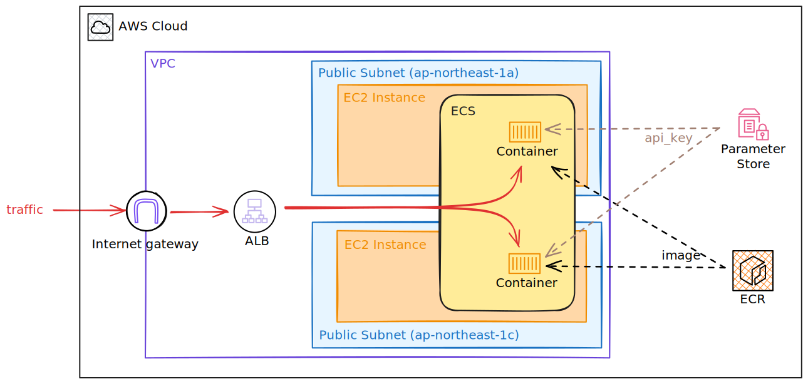

# Cloud Deployment

This document outlines the design choices behind the current AWS infrastructure architecture, as well as the compromises made to stay within cost constraints.

Load tests have been conducted to ensure the infrastructure is capable of meeting project requirements. For more details on the load tests, please refer to the [Load Test Results](./load_test_results/README.md) document.

## Caveats
To keep the architecture within the AWS free tier limitations, the following compromises and workarounds were made:
- **No private subnets:** Implementing private subnets would have required a NAT gateway, a paid feature. Instead, public IPs are used, with security enforced by Security Groups.
- **No HTTPS support:** Enabling HTTPS would require a certificate, a Route 53 domain record (paid feature), and a domain purchase. Therefore, the ALB DNS name is used in place of a proper domain, and traffic is only accepted over HTTP. Security vulnerabilities of HTTP such as man-in-the-middle attacks are not considered for this project.

## Architecture

**Subnets:**
- There are two public subnets created in different AZs (Availability Zones) to divide the workload, and to allow for higher service availability.
- This is also to satisfy the Application Load Balancer (ALB) requirement of having a minimum of two AZs.

**EC2 Instances:**
- Each EC2 instance has a public IP address, making it accessible from the internet.
- While not ideal, this is necessary to enable the instances to register with the ECS control plane. Without public IPs or a NAT gateway, the instances would be unable to access the internet, and as a result, unable to communicate with ECS.

**ECS:**
- A maximum of one container runs on each EC2 instance at a time due to task definitions that hard-code the container port. This prevents multiple containers from running on the same instance simultaneously.
- ECS is configured to run only one container at a time, so that when a new container is started, there is always an instance available to accommodate it during a rolling upgrade.
- Container images are stored in and retrieved from AWS ECR.
- The API key is encrypted and stored as a secure string in AWS Systems Manager (SSM) Parameter Store. It is then injected directly into the container, avoiding any exposure outside the container.

**Application Load Balancer:**
- Instance IP addresses are unreliable because they can change after instance rollovers. Therefore, the ALB DNS name is used as the entry point to the service.
- ECS service automatically registers and maintains new containers as targets reachable by the ALB. The ALB then distributes traffic to the available containers evenly.
